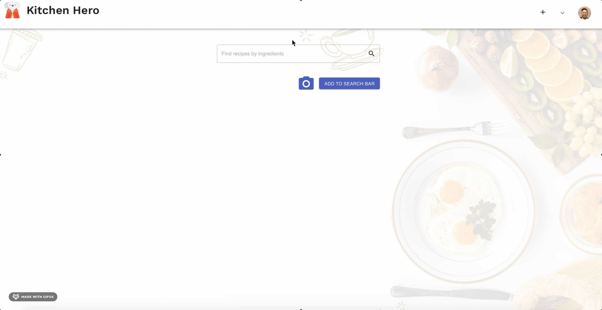
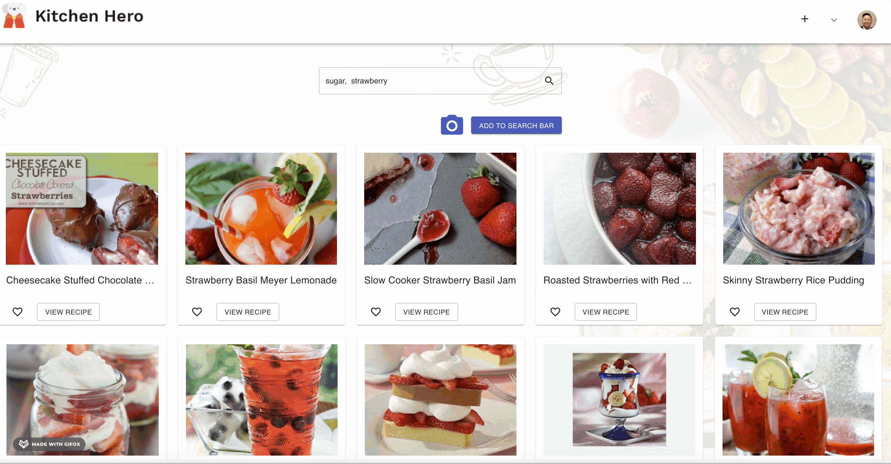

# Kitchen Hero
A Full-stack web application that allows users to search for both food and cocktail recipes based on the ingredients that they have by either typing them in the search bar, or by uploading a picture of their food product. Users can save any recipes that were found, translate to another language, create own custom recipes . Lastly, it also allows users to add and keep track of their food product expiry dates

## Final Product
### Login page

### The image recognition feuture

### Recipe details

## Dependencies
- Node.js
- Axios
- Clarifai NodeJS
- React Router DOM
- Auth0
- Moment
- React
- React Share
- PostgreSQL
- HTML5
- CSS3
- Nodemon
- Material-UI
- Express
- Dotenv

## Getting Started
1. Instal PostgreSQL (https://www.robinwieruch.de/postgres-sql-macos-setup)
2. Install all dependencies (using npm install command)
3. Add API keys for Clarifai, Cloudinary and Spoonacular to your .env file
4. Run DB using pg_ctl -D /usr/local/var/postgres start
5. Run backend server using nodemon server
6. Run frontend server from recipe-app folder using npm start
7. Open app in a browser with localhost:3000/
